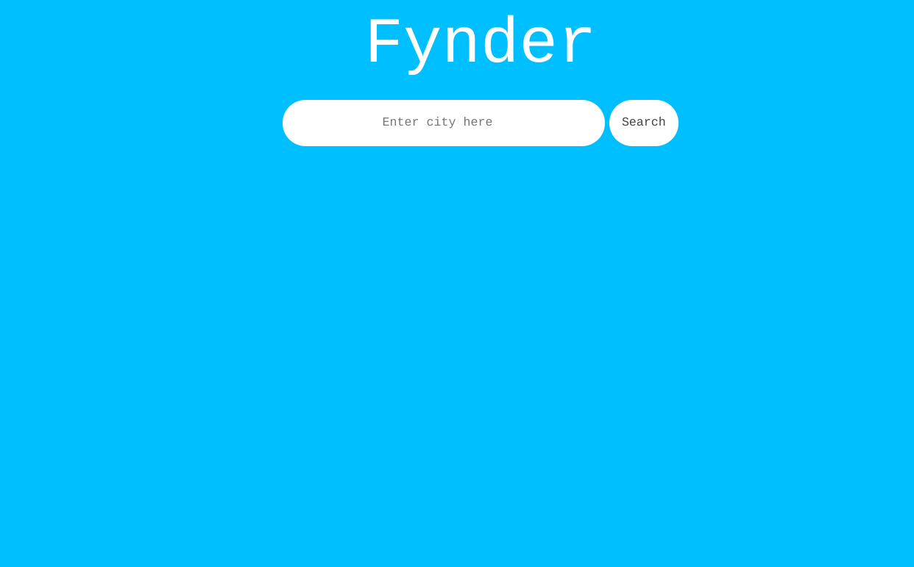
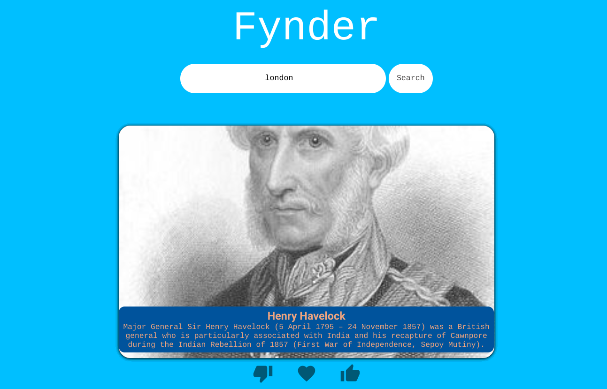
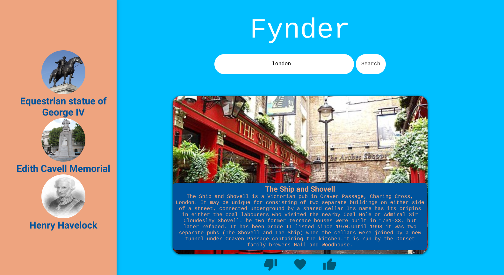

# Fynder

## Description

Our motivation for building this application was to help tourists find local landmarks and interesting establishments to vist. The reason why we built this project was to give the user easy access to local tourist spots. The problem that our application solves is to have quick and easy access to tourist spots rather than trying to figure it out alone. What we learned throughout this project was how to use agile development, deploy websites on netlify also use global variables.  

## Table of Contents

- [Installation](#installation)
- [Usage](#usage)
- [Credits](#credits)
- [License](#license)
- [Links](#link)
- [Tests](#tests)

## Installation

N/A

## Usage

The usage of this project are to help the user find local tourist spots to visit, for a visual aid on how the application works please refer to the screenshots below.

## Credits

Sean Stevenson - https://github.com/Stevenseanson

Alhassan Dumbuya - https://github.com/alhassandumbuya

Aqeel Mustapha-Garner - https://github.com/AqeelMGarner

## License

Please refer to LICENSE in the repository.

## Link

Deployed Website - https://fynder2.netlify.app/

## Tests

To view tests refer to App.test.js in the repository.
